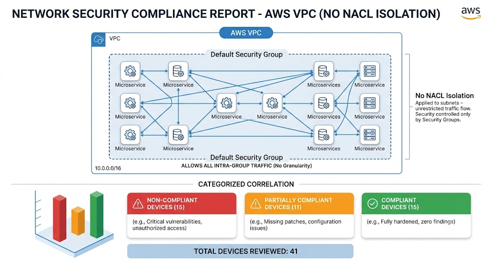
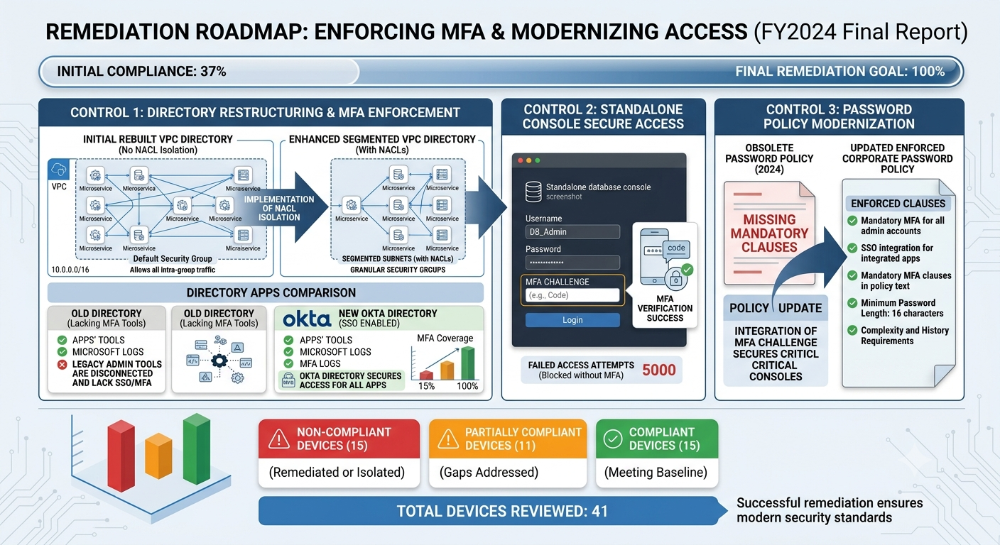

# network-security-compliance-report
# AWS Cloud Infrastructure & Network Security Compliance Report

## 📌 Executive Summary
This repository contains a comprehensive security compliance review evaluating a total of 41 cloud devices and microservices against enterprise hardening baselines. The objective of this audit was to identify network isolation gaps, evaluate Identity and Access Management (IAM) controls, and establish a clear technical remediation roadmap for engineering leadership.

---

## 🔍 Key Findings & Architecture Analysis

### 1. Flat Network Topology & Missing NACL Isolation
A critical vulnerability was identified within our AWS environment. Microservices currently share a flat, default security group with unrestricted intra-group traffic allowed. The architecture lacks Network Access Control List (NACL) isolation at the subnet level, presenting a significant lateral movement risk.

### 2. Identity & Access Management (IAM) Vulnerabilities
* **Okta Directory Gaps:** Legacy administrative tools and standalone consoles are entirely disconnected from central Single Sign-On (SSO) and Multi-Factor Authentication (MFA) protocols.
* **Console Security:** Standalone database console login prompts lack a mandatory MFA challenge field, relying solely on basic single-factor authentication.
* **Outdated Policy Documentation:** The current Corporate Password Policy PDF (last updated 2024) lacks mandatory MFA enforcement clauses for administrative access.

---

## 🛠️ Remediation Roadmap
To systematically secure the environment, the 41 reviewed devices have been categorized into a prioritized three-tier compliance tracking framework:

*   **🚨 Non-Compliant (15 Devices):** Requires immediate network segmentation (NACL enforcement), decommissioning of legacy admin tools, and mandatory MFA implementation for all database console logins.
*   **⚠️ Partially Compliant (11 Devices):** Requires policy modernization to update the 2024 Corporate Password Policy and integrate missing MFA clauses.
*   **✅ Compliant (15 Devices):** Currently meeting baseline hardening standards; continuous monitoring enabled.

---

## 📂 Repository Structure
* `/artifacts` - Contains the full data analysis spreadsheets and formal compliance report.
* `/assets` - High-resolution technical architecture and roadmap infographics.
